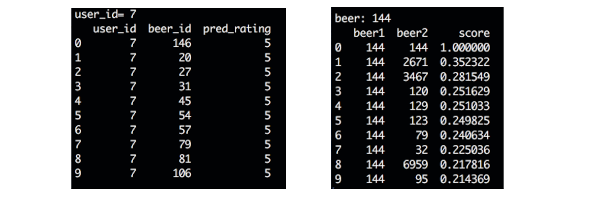
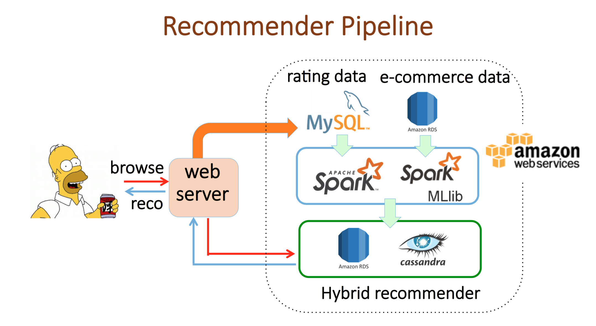

# Hybrid recommender system: content-based and collaborative filtering

In this project, I integrated product features, customers' ratings and purchase history to design a recommendation engine. The system provides item-item and user-item recommendation hybrizing the content-based and collaborative filtering. 
The prototype dashboard looks like (assume a customer whose `ID = 7` is browsing the `product_ID = 144` web page) 

where the left hand interface gives user-item recommendation, whereas the right hand shows item-item recommendation.
In the item-item recommendation, `score` is the similarity computed by cosine-similarity in the vector space given by content features, e.g. `body`, `taste`, `country` etc. Here the example shows top-10 beers which are similar to `product_ID = 144`.

In the user-item recommendaiton, the neighborhood model and matrix-factorization techniques with ALS model are implemented to predict ratings. Since each customer has different preferences and tastes, such a recommendation is personalized.
In the dashboard, we recommend top-10 beers to the `ID = 7` customer based on his/her preference. 

 
The pipeline of the prototype recommendation engine is shown below. In the backend, the recommendation tables are prepared offline using Spark and loaded into AWS databases. For more details, please see the presentation slides `presentation.pdf`.

